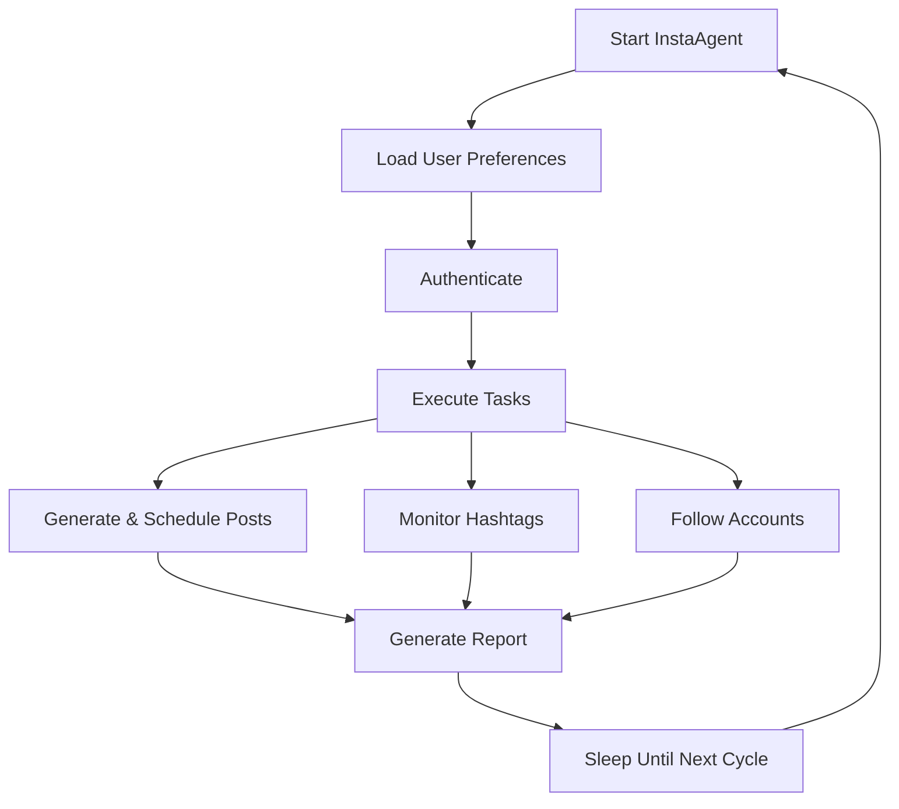

# InstaAgent

> An AI-powered Instagram automation system built with CrewAI

InstaAgent helps you manage your Instagram presence automatically, handling everything from content creation to audience growth.

## What It Does

- **Automates content creation** with AI-generated captions
- **Schedules posts** at optimal times for maximum engagement
- **Monitors hashtags** and follows relevant accounts
- **Manages authentication** securely with automatic token refresh

## How It Works



## Quick Start

```bash
# Clone the repository
git clone https://github.com/shubhx3/instaagent.git

# Set up environment
cp .env.example .env
# Edit .env with your credentials

# Run with Docker
docker-compose up

# Or run directly
python -m src.instaagent.main run
```

## Features

- 🔐 **Secure Authentication** - OAuth management for Instagram API
- 🤖 **AI Content Creation** - Topic-aware captions with trending hashtags
- 📊 **Analytics-driven** - Optimization based on engagement metrics
- 🔄 **Fully Automated** - Set and forget operation

**For comprehensive documentation**, please see [instaagent/README.md](instaagent/README.md)
