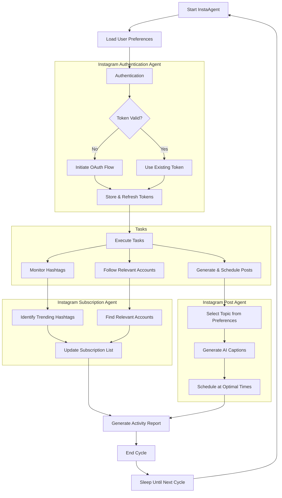

# Instagram Agent (InstaAgent)

A CrewAI-powered autonomous agent system for managing Instagram accounts. InstaAgent handles authentication, content generation, scheduling, and engagement tracking using the CrewAI framework.

## Features

- **Authentication Management**: Securely handle Instagram API authentication using OAuth flows
- **Content Generation**: AI-powered caption generation and post scheduling
- **Subscription Management**: Automatically monitor and subscribe to relevant hashtags and accounts
- **Task Orchestration**: Sequential or hierarchical processing of tasks with CrewAI

## Simple Use Case Example

Here's how you can use InstaAgent in the simplest way possible:

1. **Set up your Instagram account**:
   - Connect your Instagram business account
   - Add your API credentials to the `.env` file

2. **Define what content you want**:
   - Edit `knowledge/user_preference.txt` to tell InstaAgent what topics you like
   - Specify your preferred posting schedule (e.g., "3 times per week")

3. **Start the agent**:

   ```bash
   python -m src.instaagent.main run
   ```

4. **What happens next**:
   - InstaAgent logs into your Instagram account
   - It finds trending topics in your field (like AI or tech)
   - It creates engaging captions with relevant hashtags
   - It schedules posts at the optimal times you specified
   - It follows relevant accounts and hashtags automatically

That's it! The agent handles everything from content creation to scheduling to account growth - all running in the background while you focus on other things.# Instagram Agent (InstaAgent)

A CrewAI-powered autonomous agent system for managing Instagram accounts. InstaAgent handles authentication, content generation, scheduling, and engagement tracking using the CrewAI framework.

## Project Structure

```markdown
Instaagent
├── knowledge
│   └── user_preference.txt      # User preferences for content and engagement
├── src
│   └── instaagent               # Main package
│       ├── config
│       │   ├── agents.yaml      # Agent definitions
│       │   └── tasks.yaml       # Task definitions
│       ├── tools                # Custom tools for Instagram operations
│       │   ├── __init__.py
│       │   ├── auth_tools.py    # Authentication and token management
│       │   ├── content_tools.py # Posting and caption generation
│       │   └── subscription_tools.py # Hashtag and account monitoring
│       ├── crew.py              # CrewAI setup and configuration
│       └── main.py              # Application entry point
├── tests                        # Unit and integration tests
├── credentials                  # Storage for authentication tokens (git-ignored)
├── data                         # Data storage for the application (git-ignored)
├── .env                         # Environment variables
├── .env.example                 # Example environment variables template
├── .gitignore                   # Git ignore file
├── Dockerfile                   # Docker configuration
├── docker-compose.yml           # Docker Compose configuration
├── pyproject.toml               # Project dependencies and metadata
└── README.md                    # Project documentation
```

## Prerequisites

- Python 3.10+, <3.13
- Instagram Business Account
- Instagram Developer Account with registered application
- OpenAI API key or any LLM API Key (for CrewAI): Here we use Gemini gemma-2 27b.

## Installation

### Standard Installation

1. Clone the repository:

   ```bash
   git clone https://github.com/shubhx3/instaagent.git
   cd instaagent
   ```

2. Install dependencies:

   ```bash
   pip install -e .
   ```

3. Set up environment variables:
   - Copy `.env.example` to `.env`
   - Add your Instagram API credentials and OpenAI API key

### Docker Installation

1. Clone the repository:

   ```bash
   git clone https://github.com/shubhx3/instaagent.git
   cd instaagent
   ```

2. Set up environment variables:
   - Copy `.env.example` to `.env`
   - Add your Instagram API credentials and OpenAI API key

3. Build and run with Docker Compose:

   ```bash
   docker-compose up -d
   ```

## Usage

### Basic Usage

```bash
# Standard method
python -m src.instaagent.main run

# With Docker
docker-compose up
# or
docker-compose run instaagent run
```

### Training Mode

```bash
# Standard method
python -m src.instaagent.main train 5 training_results.json

# With Docker
docker-compose run instaagent train 5 training_results.json
```

### Testing Mode

```bash
# Standard method
python -m src.instaagent.main test 3 gpt-4

# With Docker
docker-compose run instaagent test 3 gpt-4
```

### Replay Mode

```bash
# Standard method
python -m src.instaagent.main replay task_id_123

# With Docker
docker-compose run instaagent replay task_id_123
```

## Use Case Scenario

Here's how you can use InstaAgent in the simplest way possible:

1. **Set up your Instagram account**:
   - Connect your Instagram business account
   - Add your API credentials to the `.env` file

2. **Define what content you want**:
   - Edit `knowledge/user_preference.txt` to tell InstaAgent what topics you like
   - Specify your preferred posting schedule (e.g., "3 times per week")

3. **Start the agent**:

   ```bash
   python -m src.instaagent.main run
   ```

4. **What happens next**:
   - InstaAgent logs into your Instagram account
   - It finds trending topics in your field (like AI or tech)
   - It creates engaging captions with relevant hashtags
   - It schedules posts at the optimal times you specified
   - It follows relevant accounts and hashtags automatically

That's it! The agent handles everything from content creation to scheduling to account growth - all running in the background while you focus on other things.

## Configuration

### User Preferences

Edit the `knowledge/user_preference.txt` file to customize:

- Content topics and tone
- Posting frequency and timing
- Hashtags and accounts to monitor
- Content restrictions

### Agent Configuration

Edit the YAML files in `src/instaagent/config/` to modify:

- Agent roles, goals, and backstories
- Task definitions and assignments
- Process flow (sequential or hierarchical)

## Development

### Adding New Tools

1. Create a new tool class in `src/instaagent/tools/`
2. Inherit from `BaseTool` and implement the `_run` method
3. Register your tool with the appropriate agent in `crew.py`

### Creating Tests

Add tests to the `tests/` directory following the project's testing patterns.

### Docker Development

For development with Docker:

1. **Building the image after changes:**

   ```bash
   docker-compose build
   ```

2. **Running shell in the container:**

   ```bash
   docker-compose run instaagent bash
   ```

3. **Viewing logs:**

   ```bash
   docker-compose logs -f
   ```

4. **Stopping the container:**

   ```bash
   docker-compose down
   ```

## How It Works

InstaAgent automates Instagram management using a system of specialized AI agents powered by the CrewAI framework:



### Key Workflow Steps

1. **Initialization & Authentication**
   - The application loads user preferences from configuration files
   - The Authentication Agent ensures valid Instagram API access
   - OAuth flows are handled automatically with token refresh

2. **Content Creation & Posting**
   - Topics are selected based on user preferences
   - AI-generated captions are created with relevant hashtags
   - Posts are scheduled at optimal times for maximum engagement

3. **Audience Growth**
   - The Subscription Agent monitors trending hashtags in your niche
   - Relevant accounts are identified for following
   - Engagement metrics determine which hashtags and accounts to prioritize

4. **Automation Cycle**
   - All activities are logged and reported
   - The system sleeps until the next scheduled cycle
   - User preferences can be updated at any time

## License

MIT License

## Acknowledgements

- [CrewAI](https://github.com/joaomdmoura/crewAI)
- Instagram Graph API
